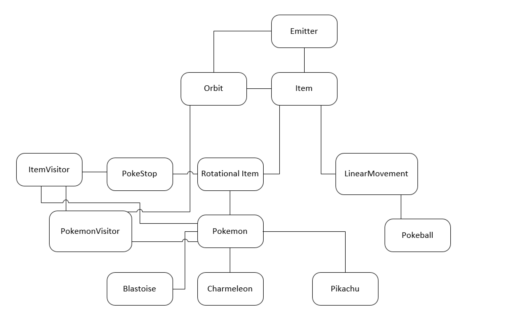
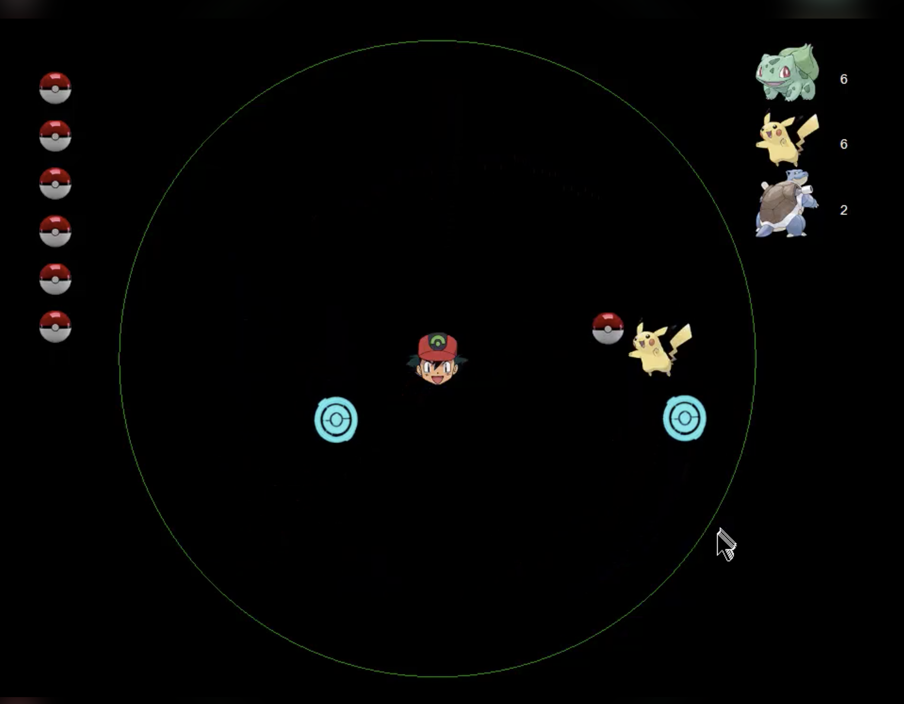

(Refresh date 06.07.20)

Pokemon Game using Visual C++. Core concepts learned: Inheritance; Polymorphism; Visitor Pattern; Encapsulation. This project was completed Fall 2016 and was for my CSE 335 course (Object Oriented Software Design) at Michigan State University. 

UML Diagram 

Gameplay Screenshot 
 
